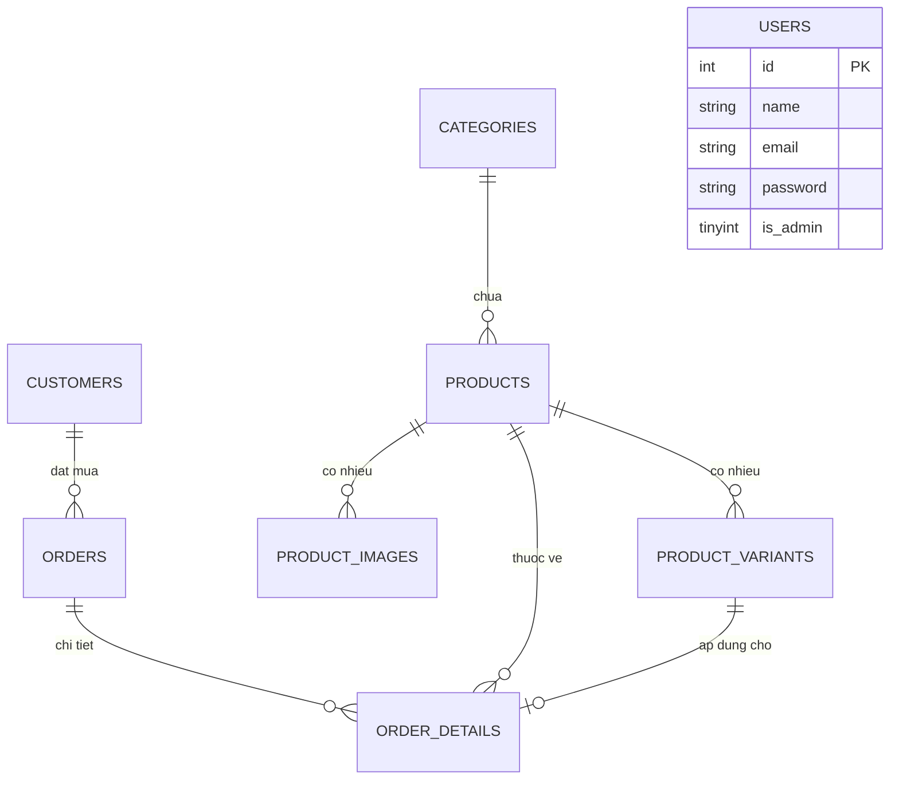
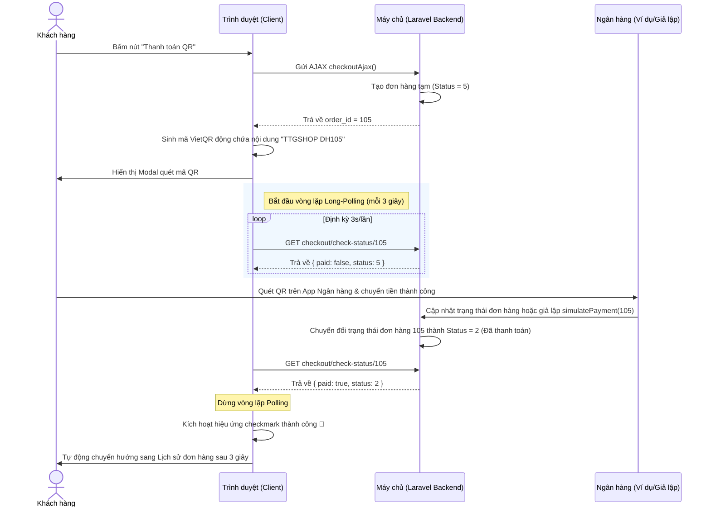

# BÁO CÁO ĐỒ ÁN TỐT NGHIỆP / ĐỒ ÁN MÔN HỌC
## ĐỀ TÀI: XÂY DỰNG WEBSITE THƯƠNG MẠI ĐIỆN TỬ KINH DOANH LAPTOP TÍCH HỢP THANH TOÁN VIETQR VÀ WEB-SOCKET REALTIME
**Hệ thống:** SPATACUS - Siêu thị Laptop chính hãng
**Công nghệ sử dụng:** PHP, Laravel Framework, MySQL, TailwindCSS, WebSockets (Laravel WebSockets & Laravel Echo)

---

## MỤC LỤC
1. [MỞ ĐẦU](#1-mở-đầu)
   - 1.1. Đặt vấn đề
   - 1.2. Mục tiêu đề tài
2. [PHÂN TÍCH HỆ THỐNG VÀ YÊU CẦU](#2-phân-tích-hệ-thống-và-yêu-cầu)
   - 2.1. Yêu cầu chức năng (Functional Requirements)
   - 2.2. Yêu cầu phi chức năng (Non-Functional Requirements)
   - 2.3. Sơ đồ Ca sử dụng (Use Case Diagram)
3. [KIẾN TRÚC HỆ THỐNG & CÔNG NGHỆ](#3-kiến-trúc-hệ-thống--công-nghệ)
   - 3.1. Công nghệ Frontend
   - 3.2. Công nghệ Backend
   - 3.3. Cơ sở dữ liệu MySQL
   - 3.4. Công nghệ WebSockets & Cơ chế thanh toán Realtime
4. [THIẾT KẾ CƠ SỞ DỮ LIỆU (DATABASE SCHEMA)](#4-thiết-kế-cơ-sở-dữ-liệu-database-schema)
   - 4.1. Sơ đồ mối quan hệ thực thể (ERD)
   - 4.2. Đặc tả chi tiết các bảng cơ sở dữ liệu
5. [CHI TIẾT THIẾT KẾ & TRIỂN KHAI CÁC CHỨC NĂNG](#5-chi-tiết-thiết-kế--triển-khai-các-chức-năng)
   - 5.1. Phân hệ khách hàng (Frontend Client)
   - 5.2. Phân hệ quản trị viên (Admin Portal)
6. [GIẢI PHÁP CÔNG NGHỆ NÂNG CAO VÀ ĐỘC ĐÁO](#6-giải-pháp-công-nghệ-nâng-cao-và-độc-đáo)
   - 6.1. Quy trình thanh toán tự động VietQR đồng bộ Realtime
   - 6.2. Thuật toán khôi phục giỏ hàng khi hủy đơn hàng QR
   - 6.3. Hệ thống WebSockets và Trạng thái kết nối thời gian thực
7. [HƯỚNG DẪN CÀI ĐẶT VÀ CẤU HÌNH](#7-hướng-dẫn-cài-đặt-và-cấu-hình)
   - 7.1. Yêu cầu hệ thống
   - 7.2. Các bước triển khai
8. [KẾT LUẬN VÀ HƯỚNG PHÁT TRIỂN](#8-kết-luận-và-hướng-phát-triển)
   - 8.1. Kết quả đạt được
   - 8.2. Hạn chế và hướng phát triển tương lai

---

## 1. MỞ ĐẦU

### 1.1. Đặt vấn đề
Cùng với sự phát triển mạnh mẽ của thương mại điện tử (E-Commerce), việc mua sắm thiết bị công nghệ cao trực tuyến, đặc biệt là Laptop, ngày càng phổ biến. Tuy nhiên, việc bán mặt hàng laptop trực tuyến gặp một số khó khăn đặc thù:
- Mỗi dòng laptop có nhiều phiên bản cấu hình khác nhau (CPU, RAM, ổ cứng, màu sắc) dẫn đến giá thành khác nhau. Việc xây dựng một trang web quản lý tốt sản phẩm có cấu trúc phân lớp biến thể (Variants) là bắt buộc.
- Quy trình thanh toán truyền thống bằng chuyển khoản ngân hàng thủ công gây nhiều rủi ro: Khách chuyển tiền xong phải chụp màn hình gửi cho nhân viên xác nhận thủ công, hoặc nếu khách quên ấn xác nhận trên website sau khi chuyển khoản thì đơn hàng không được ghi nhận trong cơ sở dữ liệu.
- Nhân viên quản lý đơn hàng (Admin) thiếu tính năng nhận dạng thời gian thực khi có khách hàng đặt mua, làm giảm tốc độ xử lý đơn hàng.

Để giải quyết các vấn đề trên, đề tài **"Xây dựng Website thương mại điện tử kinh doanh Laptop tích hợp thanh toán VietQR và Web-Socket Realtime"** được đề xuất và phát triển dựa trên hệ thống **SPATACUS**.

### 1.2. Mục tiêu đề tài
- Xây dựng một website thương mại điện tử kinh doanh Laptop hoàn chỉnh với giao diện responsive, hiện đại sử dụng TailwindCSS.
- Thiết kế cơ sở dữ liệu tối ưu cho phép quản lý sản phẩm có nhiều biến thể cấu hình linh hoạt.
- Tích hợp giải pháp thanh toán tự động thông minh bằng VietQR kết hợp cơ chế Client Long-Polling giúp kiểm tra trạng thái thanh toán tự động theo thời gian thực mà không cần người dùng thao tác thủ công.
- Tích hợp hệ thống WebSockets độc lập giúp đẩy thông tin đơn hàng mới đến Admin thời gian thực, đồng thời hiển thị trực quan trạng thái kết nối WebSocket đến người dùng.

---

## 2. PHÂN TÍCH HỆ THỐNG VÀ YÊU CẦU

### 2.1. Yêu cầu chức năng (Functional Requirements)
Hệ thống được phân chia làm hai phân hệ chính:

#### A. Phân hệ Khách hàng (Client Portal)
1. **Xem và tìm kiếm sản phẩm:** Xem danh sách laptop theo các danh mục chuyên biệt (Gaming, Văn phòng, Đồ họa, Macbook...). Tìm kiếm sản phẩm thông minh bằng thanh công cụ có tính năng gợi ý kết quả tức thời (Search Suggestions).
2. **Chi tiết sản phẩm nâng cao:** Xem hình ảnh chi tiết (Album ảnh sản phẩm), chọn lựa cấu hình biến thể (CPU, RAM, ổ cứng, màu sắc) và xem giá tương ứng thời gian thực.
3. **Quản lý giỏ hàng:** Thêm sản phẩm theo biến thể vào giỏ hàng, cập nhật số lượng, xóa sản phẩm bằng AJAX mượt mà.
4. **In báo giá (Print Quotation):** Cho phép người dùng xuất hóa đơn báo giá tạm thời của giỏ hàng ra file PDF hoặc bản in giấy với thuật toán chuyển đổi tổng số tiền từ số thành chữ tiếng Việt chính xác.
5. **Thanh toán đa phương thức:**
   - Đặt hàng COD (Thanh toán khi nhận hàng).
   - Thanh toán qua cổng VNPAY.
   - Thanh toán VietQR Realtime tự động: Hệ thống tạo đơn hàng tạm, hiển thị mã QR động chứa số tiền và nội dung chuyển khoản định danh duy nhất. Hệ thống tự động lắng nghe giao dịch thành công và chuyển hướng trang.
6. **Lịch sử mua hàng:** Theo dõi trạng thái đơn hàng (Chờ xác nhận, Chờ thanh toán, Đang chuẩn bị, Đang giao, Đã giao, Đã hủy). Khách hàng có quyền hủy các đơn hàng đang ở trạng thái chờ xác nhận hoặc chờ thanh toán (hệ thống tự động hoàn kho và phục hồi giỏ hàng cũ).
7. **Đăng ký/Đăng nhập:** Xác thực tài khoản khách hàng thông thường để lưu vết mua sắm.

#### B. Phân hệ Quản trị (Admin Portal)
1. **Quản trị danh mục:** Thêm, sửa, xóa các danh mục sản phẩm (Laptop Gaming, Đồ họa...).
2. **Quản trị sản phẩm và biến thể:** Thêm mới sản phẩm, tải lên ảnh đại diện và bộ sưu tập ảnh chi tiết. Quản lý danh sách các cấu hình biến thể (CPU, RAM, Storage, Color, Price, Stock) tương ứng của từng máy.
3. **Quản trị đơn hàng:** Xem danh sách đơn hàng toàn hệ thống với các bộ lọc trạng thái và thống kê metrics quan trọng (doanh thu thực tế, số đơn chờ xử lý, số đơn hoàn thành...).
4. **Cập nhật trạng thái đơn hàng:** Đổi trạng thái đơn hàng và tự động cập nhật số lượng tồn kho của sản phẩm tương ứng (Hoàn kho khi đơn bị hủy, Trừ kho khi đơn hoạt động trở lại).
5. **Nhận thông báo Realtime:** Hệ thống nhận thông báo tức thời thông qua WebSocket khi có khách đặt hàng mới hoặc hủy hàng mà không cần tải lại trang.

### 2.2. Yêu cầu phi chức năng (Non-Functional Requirements)
- **Hiệu năng & Tốc độ phản hồi:** Tốc độ tải trang nhanh, các tác vụ thêm giỏ hàng, gợi ý tìm kiếm, tạo đơn thanh toán QR phải được thực hiện thông qua AJAX để tránh giật lag UI.
- **Trải nghiệm người dùng (UX):** Thiết kế giao diện hiện đại, trực quan, có các hiệu ứng chuyển động khi hover và hệ thống Toast thông báo mượt mà. Màn hình thanh toán QR có hiệu ứng đếm ngược và hình hoạt họa checkmark thành công chuyên nghiệp.
- **Độ tin cậy của quy trình thanh toán:** Ngăn chặn tuyệt đối tình trạng khách chuyển khoản thành công nhưng đơn hàng không được ghi nhận trong cơ sở dữ liệu.
- **Khả năng đáp ứng thiết bị:** Tương thích hoàn toàn trên thiết bị di động, máy tính bảng và máy tính để bàn (Responsive).

### 2.3. Sơ đồ Ca sử dụng (Use Case Diagram)
Dưới đây là sơ đồ mô tả các tác nhân và hành vi tương tác với hệ thống:

```mermaid
usecaseDiagram
    actor "Khách Hàng (Customer)" as customer
    actor "Quản Trị Viên (Admin)" as admin

    rectangle "Hệ Thống Laptop SPATACUS" {
        usecase "Đăng nhập / Đăng ký" as UC_Auth
        usecase "Tìm kiếm & Xem sản phẩm" as UC_View
        usecase "Quản lý giỏ hàng & In báo giá" as UC_Cart
        usecase "Thanh toán VietQR Realtime" as UC_PayQR
        usecase "Thanh toán COD / VNPAY" as UC_PayOthers
        usecase "Theo dõi & Hủy đơn hàng" as UC_History
        
        usecase "Quản lý Sản phẩm & Biến thể" as UC_ManageProducts
        usecase "Quản lý Đơn hàng & Kho hàng" as UC_ManageOrders
        usecase "Theo dõi Metrics & Doanh thu" as UC_Dashboard
        usecase "Nhận thông báo đơn hàng Realtime" as UC_WSNotify
    }

    customer --> UC_Auth
    customer --> UC_View
    customer --> UC_Cart
    customer --> UC_PayQR
    customer --> UC_PayOthers
    customer --> UC_History

    admin --> UC_Auth
    admin --> UC_ManageProducts
    admin --> UC_ManageOrders
    admin --> UC_Dashboard
    admin --> UC_WSNotify
```

---

## 3. KIẾN TRÚC HỆ THỐNG & CÔNG NGHỆ

Hệ thống được xây dựng trên mô hình MVC (Model - View - Controller) chuẩn của Laravel Framework, mang lại sự độc lập giữa cơ sở dữ liệu, logic nghiệp vụ và giao diện hiển thị.

```
                  ┌──────────────────────────────┐
                  │          Trình duyệt         │
                  │ (TailwindCSS, Echo, VietQR)  │
                  └──────────────┬───────────────┘
                                 │ AJAX / HTTP Requests
                                 ▼
                  ┌──────────────────────────────┐
                  │      Laravel Controller      │
                  │   (Home & Admin Controller)  │
                  └──────────────┬───────────────┘
                     ▲           │           ▲
        Eloquent ORM │           │ SQL       │ Dispatch Events
                     ▼           ▼           ▼
       ┌───────────────────┐ ┌───────────┐ ┌───────────────────┐
       │   Models & DB     │ │   MySQL   │ │  WebSockets Server│
       │ (User, Order,...) │ │  Database │ │ (Pusher Protocol) │
       └───────────────────┘ └───────────┘ └───────────────────┘
```

### 3.1. Công nghệ Frontend
- **TailwindCSS (v3.x - CDN):** Sử dụng các utility classes để xây dựng giao diện nhanh, tối ưu hóa CSS sinh ra, tùy biến bảng màu sắc sinh động (màu chủ đạo `primary: #ff3d00` rực rỡ, tông nền tối `darkBg: #051923` cao cấp).
- **JavaScript (Vanilla ES6):** Xử lý toàn bộ luồng gọi AJAX (Fetch API) để thực hiện tìm kiếm suggestions, thêm giỏ hàng, gọi API kiểm tra trạng thái thanh toán QR và hiển thị thông báo.
- **FontAwesome (v6.4.0):** Cung cấp hệ thống biểu tượng (icons) sắc nét phục vụ giao diện thiết kế chuyên nghiệp.

### 3.2. Công nghệ Backend
- **Laravel Framework (v8.75):** Framework PHP mạnh mẽ cung cấp các module định tuyến (Routing), quản lý Session, bảo mật chống tấn công XSS, CSRF, SQL Injection, và quản lý Database thông qua Eloquent ORM.
- **Laravel Events & Listeners:** Phát các sự kiện `OrderPlaced` và `OrderStatusUpdated` để tự động thông báo đến các kênh liên kết thời gian thực.
- **PHP Session:** Lưu trữ trạng thái giỏ hàng độc lập trước khi khách hàng tiến hành thanh toán, giảm tải cho cơ sở dữ liệu.

### 3.3. Cơ sở dữ liệu MySQL
Hệ thống sử dụng cơ sở dữ liệu quan hệ MySQL để quản trị dữ liệu đồng bộ và toàn vẹn thông tin thông qua cơ chế khóa ngoại và ràng buộc (Cascading).

### 3.4. Công nghệ WebSockets & Cơ chế thanh toán Realtime
- **beyondcode/laravel-websockets:** Gói thư viện giúp tự khởi chạy một máy chủ WebSocket độc lập chạy trên nền tảng PHP tương thích giao thức Pusher, loại bỏ sự phụ thuộc vào các dịch vụ bên thứ ba có phí.
- **Laravel Echo & Pusher JS CDN:** Thư viện JavaScript chạy ở Client giúp đăng ký kênh (Channels) và lắng nghe các sự kiện phát đi từ Backend Server một cách dễ dàng.
- **VietQR API & Client Long-Polling:** Giải pháp quét mã QR đồng bộ trạng thái tự động không phụ thuộc vào Webhook ngân hàng phức tạp bằng cách thực hiện Polling định kỳ mỗi 3 giây thông qua AJAX an toàn.

---

## 4. THIẾT KẾ CƠ SỞ DỮ LIỆU (DATABASE SCHEMA)

### 4.1. Sơ đồ mối quan hệ thực thể (ERD)
Dưới đây là thiết kế mối liên kết giữa các bảng chính trong hệ thống bán laptop SPATACUS:



### 4.2. Đặc tả chi tiết các bảng cơ sở dữ liệu

#### 1. Bảng `categories` (Danh mục sản phẩm)
Lưu trữ thông tin phân loại laptop phục vụ việc gom nhóm sản phẩm.
- `id` (INT UNSIGNED, Primary Key, Auto Increment): Mã danh mục.
- `name` (VARCHAR(255), Unique): Tên danh mục (ví dụ: Laptop Gaming, Ultrabook Mỏng Nhẹ...).
- `status` (TINYINT): Trạng thái hiển thị (1: Hoạt động, 0: Ẩn).
- `created_at` & `updated_at`: Thời gian khởi tạo và cập nhật.

#### 2. Bảng `products` (Sản phẩm chính)
Lưu trữ thông tin cơ bản, mô tả chung của từng dòng máy laptop.
- `id` (INT UNSIGNED, Primary Key, Auto Increment): Mã sản phẩm.
- `name` (VARCHAR(200), Unique): Tên đầy đủ của sản phẩm laptop.
- `price` (FLOAT(20,3)): Giá gốc của dòng sản phẩm.
- `sale_price` (FLOAT(20,3)): Giá khuyến mại (nếu có).
- `image` (VARCHAR(255)): Ảnh đại diện chính của sản phẩm.
- `category_id` (INT UNSIGNED, Foreign Key): Liên kết đến bảng `categories(id)`.
- `status` (TINYINT): Trạng thái hiển thị (1: Đang bán, 0: Ngừng bán).
- `description` (TEXT): Mô tả chi tiết cấu hình và đặc tính của sản phẩm.
- `created_at` & `updated_at`: Thời gian khởi tạo và cập nhật.

#### 3. Bảng `product_variants` (Biến thể cấu hình sản phẩm)
Lưu trữ các cấu hình chi tiết khác nhau của cùng một dòng sản phẩm chính.
- `id` (INT UNSIGNED, Primary Key, Auto Increment): Mã biến thể.
- `product_id` (INT UNSIGNED, Foreign Key): Liên kết đến bảng `products(id)` (Cascade delete).
- `sku` (VARCHAR(100), Nullable): Mã ký hiệu quản lý kho của biến thể cấu hình.
- `cpu` (VARCHAR(100), Nullable): Tên bộ vi xử lý (ví dụ: Intel Core i7-13700H, AMD Ryzen 7 7840HS).
- `ram` (VARCHAR(50), Nullable): Dung lượng RAM (ví dụ: 16GB DDR5, 32GB DDR5).
- `storage` (VARCHAR(100), Nullable): Dung lượng lưu trữ (ví dụ: 512GB SSD PCIe NVMe, 1TB SSD).
- `color` (VARCHAR(50), Nullable): Màu sắc máy (ví dụ: Storm Grey, Obsidian Black).
- `price` (FLOAT(20,3)): Giá bán riêng của cấu hình này.
- `stock` (INT): Số lượng hàng có sẵn trong kho của cấu hình này.
- `created_at` & `updated_at`: Thời gian khởi tạo và cập nhật.

#### 4. Bảng `product_images` (Bộ sưu tập ảnh chi tiết)
Lưu trữ album ảnh chi tiết bổ sung cho sản phẩm nhằm tăng tính thuyết phục của sản phẩm.
- `id` (INT UNSIGNED, Primary Key, Auto Increment): Mã hình ảnh.
- `product_id` (INT UNSIGNED, Foreign Key): Liên kết đến bảng `products(id)` (Cascade delete).
- `image` (VARCHAR(255)): Đường dẫn tập tin hình ảnh.
- `type` (TINYINT): Phân loại định dạng ảnh hiển thị (1: Ảnh góc cạnh, 2: Ảnh tính năng...).
- `sort_order` (INT): Thứ tự sắp xếp hiển thị trên slide album.
- `created_at` & `updated_at`: Thời gian khởi tạo và cập nhật.

#### 5. Bảng `customers` (Khách hàng mua hàng)
Lưu trữ thông tin khách hàng mua hàng phục vụ quản trị và theo dõi hành vi mua sắm.
- `id` (INT UNSIGNED, Primary Key, Auto Increment): Mã khách hàng.
- `name` (VARCHAR(200)): Họ tên khách hàng.
- `email` (VARCHAR(255), Unique): Địa chỉ email.
- `phone` (VARCHAR(20), Unique): Số điện thoại liên lạc.
- `address` (VARCHAR(255)): Địa chỉ giao nhận mặc định.
- `password` (VARCHAR(255)): Mật khẩu đã mã hóa Hash phục vụ đăng nhập.
- `created_at` & `updated_at`: Thời gian khởi tạo và cập nhật.

#### 6. Bảng `orders` (Đơn đặt hàng)
Lưu trữ thông tin tổng quát về hóa đơn đặt hàng của khách hàng.
- `id` (INT UNSIGNED, Primary Key, Auto Increment): Mã đơn hàng.
- `name` (VARCHAR(200)): Họ tên người nhận hàng.
- `email` (VARCHAR(255), Nullable): Email người nhận.
- `phone` (VARCHAR(20), Nullable): Số điện thoại nhận hàng.
- `address` (VARCHAR(255), Nullable): Địa chỉ chi tiết nhận hàng.
- `customer_id` (INT UNSIGNED, Foreign Key): Liên kết đến bảng `customers(id)`.
- `status` (TINYINT): Trạng thái đơn hàng (1: Chờ xác nhận, 5: Chờ thanh toán QR, 2: Đang chuẩn bị/Đã thanh toán, 3: Đang giao, 4: Đã giao, 0: Đã hủy).
- `created_at` & `updated_at`: Thời gian đặt hàng và cập nhật.

#### 7. Bảng `order_details` (Chi tiết đơn đặt hàng)
Liên kết n-n giữa sản phẩm, biến thể sản phẩm và đơn đặt hàng.
- `order_id` (INT UNSIGNED, Foreign Key): Liên kết đến bảng `orders(id)`.
- `product_id` (INT UNSIGNED, Foreign Key): Liên kết đến bảng `products(id)`.
- `variant_id` (INT UNSIGNED, Foreign Key, Nullable): Liên kết đến bảng `product_variants(id)`.
- `quantity` (INT): Số lượng đặt mua của cấu hình sản phẩm đó.
- `price` (FLOAT(20,3)): Đơn giá thực tế tại thời điểm mua.
- Khóa chính kết hợp: `(order_id, product_id, variant_id)` hoặc `(order_id, product_id)` với `variant_id` tương thích.

#### 8. Bảng `users` (Tài khoản người dùng hệ thống)
Lưu trữ thông tin tài khoản người dùng đăng nhập hệ thống.
- `id` (INT UNSIGNED, Primary Key, Auto Increment): Mã định danh.
- `name` (VARCHAR(255)): Tên hiển thị người dùng.
- `email` (VARCHAR(255), Unique): Email đăng nhập.
- `password` (VARCHAR(255)): Mật khẩu đã mã hóa Hash.
- `is_admin` (TINYINT): Phân quyền tài khoản (1: Quản trị viên Admin, 0: Khách hàng thành viên).

---

## 5. CHI TIẾT THIẾT KẾ & TRIỂN KHAI CÁC CHỨC NĂNG

### 5.1. Phân hệ khách hàng (Frontend Client)

#### A. Trang chủ & Tìm kiếm thông minh (Search & Suggestions)
- Trang chủ hiển thị danh sách sản phẩm theo từng nhóm danh mục như "Laptop Gaming" và "Laptop Ultrabook Mỏng Nhẹ".
- Hệ thống tìm kiếm tích hợp tính năng gợi ý kết quả tự động bằng AJAX. Khi người dùng nhập từ 2 ký tự trở lên vào ô tìm kiếm, trình duyệt sẽ gửi request bất đồng bộ đến route `search/suggestions`. Backend thực hiện tìm kiếm gần đúng trên tên sản phẩm, thông số CPU, RAM hoặc mô tả, sau đó trả về danh sách JSON gồm 6 sản phẩm khớp nhất bao gồm ảnh thu nhỏ, tên sản phẩm và giá khuyến mại. Trình duyệt render kết quả lập tức giúp khách hàng truy cập nhanh sản phẩm cần tìm.

#### B. Giao diện chi tiết sản phẩm và chọn cấu hình
- Trang chi tiết sản phẩm hiển thị slide hình ảnh chi tiết tải lên từ bảng `product_images` sắp xếp theo thứ tự hiển thị.
- Khi người dùng bấm chọn các cấu hình biến thể khác nhau (ví dụ: đổi từ bản RAM 16GB sang bản RAM 32GB), JavaScript sẽ tự động tính toán cập nhật đơn giá hiển thị tương ứng, đồng thời thay đổi mã SKU và hiển thị tình trạng còn hàng hay hết hàng dựa vào thuộc tính `stock` trong dữ liệu biến thể.

#### C. Giỏ hàng & In báo giá (convertNumberToWords)
- Giỏ hàng được lưu trữ trong session giúp khách hàng thoải mái thay đổi số lượng, xóa hoặc thêm mới. Giao diện giỏ hàng hỗ trợ in báo giá tạm thời bằng cách nhập thông tin và nhấn nút xuất báo giá. 
- Hệ thống hỗ trợ in báo giá chuẩn hóa với thuật toán `convertNumberToWords` trong `Homecontroller.php`. Thuật toán này phân tích số tiền của giỏ hàng thành các nhóm hàng trăm, hàng chục và hàng đơn vị, tự động chuyển đổi sang chữ tiếng Việt tự nhiên và chuẩn văn phong kế toán (ví dụ: chuyển `25.500.000` thành *"Hai mươi nhăm triệu năm trăm nghìn đồng chẵn"*).

### 5.2. Phân hệ quản trị viên (Admin Portal)

#### A. Quản lý sản phẩm nâng cao
- Giao diện Admin cho phép thêm mới sản phẩm kèm theo biểu mẫu động để bổ sung nhiều biến thể cấu hình cùng lúc. Admin có thể ấn nút "Thêm cấu hình" để điền thêm các thông số CPU, RAM, ổ cứng, màu sắc, giá bán riêng biệt và số lượng tồn kho.
- Hệ thống upload đa tệp tin (Multi-upload) hỗ trợ tải lên album ảnh chi tiết sản phẩm cùng lúc và thiết lập thứ tự hiển thị cho từng ảnh. Khi sửa sản phẩm, hệ thống hỗ trợ xóa từng ảnh chi tiết riêng biệt bằng AJAX mà không làm ảnh hưởng đến dữ liệu chính của sản phẩm.

#### B. Quản lý đơn hàng & Cập nhật trạng thái an toàn
- Trang danh sách đơn hàng của Admin tích hợp bảng metrics thống kê số lượng đơn theo từng trạng thái và biểu đồ hiển thị tổng doanh thu từ các đơn hàng đã hoàn thành công việc giao hàng (`status = 4`).
- Trạng thái đơn hàng được Admin cập nhật thông qua form an toàn. Khi Admin chuyển trạng thái của một đơn hàng từ trạng thái hoạt động sang "Đã hủy" (`status = 0`), Backend sẽ tự động lấy thông tin chi tiết đơn hàng và thực hiện cộng hoàn trả số lượng sản phẩm vào kho hàng tương ứng của từng biến thể cấu hình nhằm chống thất thoát dữ liệu tồn kho. Ngược lại, nếu khôi phục một đơn hàng đã hủy về hoạt động, hệ thống sẽ tự động trừ kho hàng trở lại sau khi kiểm tra tính khả dụng của số lượng sản phẩm.

---

## 6. GIẢI PHÁP CÔNG NGHỆ NÂNG CAO VÀ ĐỘC ĐÁO

### 6.1. Quy trình thanh toán tự động VietQR đồng bộ Realtime

Quy trình thanh toán QR Code truyền thống yêu cầu khách hàng thực hiện chuyển khoản sau đó phải tự bấm nút xác nhận giao dịch. Nếu khách hàng lỡ tay tắt trình duyệt sau khi chuyển khoản, đơn hàng sẽ bị mất dấu. Để giải quyết triệt để rủi ro này, dự án SPATACUS đã triển khai quy trình tạo đơn hàng động VietQR kết hợp Long-Polling như sau:

1. **Khởi tạo đơn hàng trước**: Khi người dùng nhấn nút *"Thanh toán bằng QR Code"*, hệ thống gửi AJAX lên Backend tạo đơn hàng tức thì với trạng thái **"Chờ thanh toán" (status = 5)**.
2. **Định danh mã QR động**: Backend lưu đơn hàng, trả về `order_id`. Frontend lấy ID này để tạo mã VietQR động chứa nội dung chuyển khoản duy nhất và định danh: `TTGSHOP DH{order_id}` (ví dụ: `TTGSHOP DH102`).
3. **Tiến trình Long-Polling tự động**: Trình duyệt kích hoạt hàm kiểm tra định kỳ `checkPaymentPolling` gửi yêu cầu lên máy chủ mỗi 3 giây thông qua API `checkout/check-status/{order_id}` để kiểm tra trạng thái đơn hàng trong DB.
4. **Nhận diện thanh toán thành công**: Khi ngân hàng nhận tiền chuyển khoản và cập nhật trạng thái đơn hàng thành **"Đang chuẩn bị" (status = 2)** (có thể kiểm thử giả lập nhanh bằng nút *"Giả lập thanh toán thành công"* gọi đến API `simulatePayment`), API Polling sẽ trả về `{ paid: true }`.
5. **Hiển thị hiệu ứng và tự động chuyển hướng**: Ngay khi nhận được phản hồi thành công, giao diện Modal QR sẽ biến đổi mượt mà sang trạng thái thành công với hiệu ứng hoạt họa vòng tròn checkmark xanh lá và tự động đếm ngược 3 giây để chuyển hướng khách hàng về trang lịch sử đơn hàng.



### 6.2. Thuật toán khôi phục giỏ hàng khi hủy đơn hàng QR
Một tính năng nổi bật khác trong trải nghiệm người dùng của hệ thống là khả năng hủy giao dịch thanh toán QR động.
- **Vấn đề**: Khi khách hàng đã bấm thanh toán QR, giỏ hàng trong Session đã bị xóa để tránh việc đặt hàng lặp lại, đồng thời số lượng tồn kho sản phẩm đã bị trừ để giữ hàng cho khách trong thời gian chờ thanh toán. Nếu khách hàng không muốn mua nữa và bấm nút *"Hủy giao dịch"* trên Modal, đơn hàng tạm trong DB cần được dọn dẹp và trả lại trạng thái cũ cho khách.
- **Giải pháp**: Hệ thống cung cấp API `checkout/cancel-order/{id}`. Khi khách hàng nhấn hủy giao dịch QR:
  1. Backend truy vấn các chi tiết mặt hàng thuộc đơn hàng tạm đó.
  2. Thực hiện cộng trả lại số lượng tồn kho cho các cấu hình biến thể tương ứng của Laptop.
  3. Lấy thông tin chi tiết sản phẩm và ghi đè khôi phục lại Session giỏ hàng (`session()->put('cart', $cart)`) đúng như trước khi thanh toán.
  4. Thực hiện xóa dữ liệu chi tiết đơn hàng (`order_details`) và đơn hàng tạm (`orders`) khỏi Database để giải phóng dung lượng bộ nhớ.
  5. Trình duyệt đóng Modal và hiển thị lại giỏ hàng đầy đủ, tạo trải nghiệm mua sắm vô cùng mượt mà.

### 6.3. Hệ thống WebSockets và Trạng thái kết nối thời gian thực
Hệ thống sử dụng server WebSockets nội bộ dựa trên thư viện `beyondcode/laravel-websockets` để truyền tải các sự kiện thời gian thực:
- **Thông báo đơn hàng mới (Realtime Notification)**: Khi khách hàng đặt hàng thành công qua sự kiện `OrderPlaced`, hoặc trạng thái đơn hàng thay đổi qua sự kiện `OrderStatusUpdated`, Backend sẽ phát đi tín hiệu đến kênh WebSocket.
- Ở phía giao diện quản trị (Admin), thư viện Laravel Echo sẽ lắng nghe sự kiện để lập tức hiển thị thông báo toast, hoặc tự động tải lại bảng đơn hàng để cập nhật trạng thái đơn mà không cần nhấn F5 thủ công.
- **Visual Connection Badge**: Dưới Client UI, ở góc trái bên dưới màn hình, hệ thống thiết kế một thẻ hiển thị trạng thái kết nối WebSockets trực quan (Connected / Connecting / Disconnected) tự động thay đổi màu sắc (Xanh / Vàng / Đỏ) tương ứng với trạng thái kết nối từ thư viện Pusher, tăng độ tin cậy và tính thẩm mỹ cho website.

---

## 7. HƯỚNG DẪN CÀI ĐẶT VÀ CẤU HÌNH

### 7.1. Yêu cầu hệ thống
- Máy chủ cài đặt: XAMPP, Laragon hoặc Docker (chạy PHP từ 7.3 trở lên, khuyến nghị PHP 8.0).
- Hệ quản trị cơ sở dữ liệu: MySQL v5.7 trở lên.
- Quản lý thư viện PHP: Composer.

### 7.2. Các bước triển khai

**Bước 1: Tải mã nguồn và cài đặt thư viện**
```bash
# Di chuyển vào thư mục dự án
cd c:\xampp\htdocs\doan2026

# Cài đặt các thư viện PHP phụ thuộc qua Composer
composer install
```

**Bước 2: Cấu hình môi trường**
Sao chép tệp tin cấu hình môi trường `.env.example` thành `.env` và thiết lập các thông số cơ sở dữ liệu và Pusher:
```env
DB_CONNECTION=mysql
DB_HOST=127.0.0.1
DB_PORT=3306
DB_DATABASE=doan2026
DB_USERNAME=root
DB_PASSWORD=

BROADCAST_DRIVER=pusher

PUSHER_APP_ID=local-app-id
PUSHER_APP_KEY=local-app-key
PUSHER_APP_SECRET=local-app-secret
PUSHER_APP_CLUSTER=mt1
```

**Bước 3: Tạo khóa ứng dụng và di cư dữ liệu (Migration)**
```bash
# Tạo Application Key
php artisan key:generate

# Chạy di cư dữ liệu để khởi tạo cấu trúc các bảng DB
php artisan migrate
```

**Bước 4: Khởi chạy các dịch vụ máy chủ**
Hệ thống yêu cầu chạy song song 2 dịch vụ máy chủ:
1. Máy chủ Web Laravel:
   ```bash
   php artisan serve
   ```
2. Máy chủ WebSockets riêng biệt để truyền tải thông báo thời gian thực:
   ```bash
   php artisan websockets:serve
   ```

---

## 8. KẾT LUẬN VÀ HƯỚNG PHÁT TRIỂN

### 8.1. Kết quả đạt được
- Xây dựng thành công Website thương mại điện tử chuyên Laptop SPATACUS với đầy đủ các nghiệp vụ bán hàng, quản lý kho hàng và đơn hàng khoa học.
- Triển khai thành công tính năng đột phá: **Thanh toán VietQR động tự động nhận dạng trạng thái thời gian thực thông qua Long-Polling**, mang lại trải nghiệm mua sắm tiện lợi và an toàn tuyệt đối cho người dùng.
- Tích hợp thành công **hệ thống thông báo đẩy WebSockets** độc lập cho trang quản trị Admin giúp nhận biết đơn hàng mới ngay lập tức.
- Giao diện người dùng hiện đại, sử dụng TailwindCSS mượt mà, hỗ trợ tìm kiếm gợi ý tức thời và in xuất báo giá quy đổi tiền tệ ra chữ tiếng Việt chuẩn xác.

### 8.2. Hạn chế và hướng phát triển tương lai
- **Hạn chế:** Hệ thống Long-Polling mặc dù hoạt động ổn định và dễ cấu hình, nhưng nếu số lượng khách truy cập cùng lúc quá lớn (hàng triệu người dùng) có thể gây tải cho máy xuất MySQL do số lượng request kiểm tra trạng thái liên tục.
- **Hướng phát triển:**
  - Nâng cấp cơ chế Long-Polling sang lắng nghe trực tiếp sự kiện thanh toán từ WebSockets ngân hàng (Webhook của các bên trung gian PayOS, Casso...) để tối ưu hóa hiệu năng máy chủ.
  - Tích hợp hệ thống gợi ý sản phẩm thông minh sử dụng học máy (AI Recommendation System) phân tích dựa trên lịch sử xem hàng của người dùng.
  - Phát triển ứng dụng di động (Mobile App) đồng bộ hóa cơ sở dữ liệu để nâng cao trải nghiệm đa kênh.
